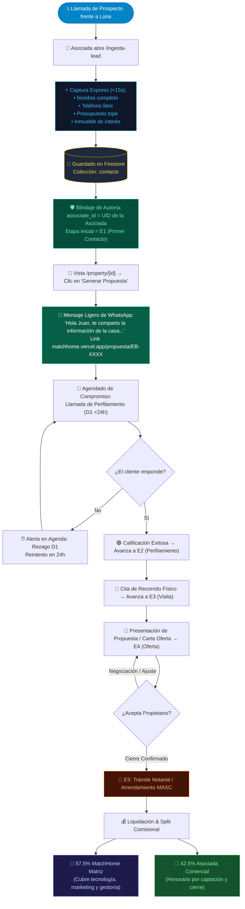

# 📑 Expediente Ejecutivo & Entregables Finales — ATAIR CRM
**Proyecto:** ATAIR CRM (Modernización Mobile-First Desacoplada)  
**URL de Producción Vercel:** [https://atair-crm.vercel.app](https://atair-crm.vercel.app)  
**Ubicación Local:** `c:\Users\Propietario\Web Projects\ATAIR SGI\ATAIR CRM`  
**Dirección General:** Enrique Marines | **Auditoría Técnica:** Antigravity AI  
**Fecha de Emisión:** Octubre 2026 | **Versión:** 1.0.0 (Gold Master)

---

## 1. Descripción General del Funcionamiento Integral

### A. Tesis del Sistema
ATAIR CRM es una aplicación web progresiva (**PWA Mobile-First**) diseñada específicamente para resolver la fricción comercial en el sector inmobiliario de Chihuahua y Delicias. Reemplaza el esquema de escritorio pesado por una herramienta ultraligera, operable con **un solo pulgar** desde el teléfono móvil, garantizando **cero fuga de prospectos** y **protección estricta de carteras**.

### B. Arquitectura de Integración de Punta a Punta
El sistema opera sin servidores intermedios costosos ni dependencias frágiles externas, vinculando 5 subsistemas nativos:

```
┌────────────────────────────────────────────────────────────────────────┐
│                        ARQUITECTURA INTEGRAL                           │
└────────────────────────────────────────────────────────────────────────┘

    [📱 Móvil / PWA de Campo]               [🖥️ Panel Matriz / Supervisión]
    - Ingesta rápida (15 segundos)         - Visión 360° de la red comercial
    - Cartera aislada por asesora          - Control de plazas (CUU / DEL)
    - Generador 1-clic WhatsApp            - Ajuste paramétrico de splits
    - Agenda táctil con SLAs               - Auditoría de prospectos huérfanos
               │                                       │
               ▼                                       ▼
    ┌─────────────────────────────────────────────────────────────┐
    │           SvelteKit + TypeScript (Frontend & SSR)           │
    │     - hooks.server.ts: Guardián de seguridad (401 API)      │
    │     - Theme Engine: Modo Oscuro por defecto / Modo Claro    │
    │     - Normalizador de esquemas híbridos tolerante           │
    └─────────────────────────────────────────────────────────────┘
                                  │
                                  ▼
    ┌─────────────────────────────────────────────────────────────┐
    │               Firebase Cloud Infrastructure                 │
    │  - Firebase Auth: Roles granulares (admin / asociado)       │
    │  - Cloud Firestore: Reactividad en vivo (onSnapshot)        │
    │  - Base de Datos Producción: matchhome-crm-46de4             │
    │  - Base de Datos Sandbox: curso-svelte-58c5d                │
    └─────────────────────────────────────────────────────────────┘
```

### C. Los 5 Pilares Operativos
1. **Autenticación & Guardián Multi-Nivel:**
   - La sesión se valida tanto en cliente (Firebase Auth) como en servidor SvelteKit (`hooks.server.ts`).
   - Bloqueo estricto contra peticiones no autorizadas en `/api/*`.
   - Sistema multi-admin automático para correos fundadores y roles de asociados con acceso restringido.
2. **Ingesta Express (15 Segundos en Lona):**
   - Resuelve el problema de capturar un lead mientras se atiende una llamada en la calle.
   - Un solo campo de nombre que se divide automáticamente en nombre y apellido (`splitFullName`).
   - Normalizador telefónico que acepta números con guiones o espacios y los estandariza en E.164 (`+52...`).
   - Asignación inmediata del prospecto al ID del asesor captador (`associate_id`), blindando su comisión.
3. **Cartera Aislada & Pipeline Progresivo:**
   - Cada asociada ve únicamente sus propios clientes.
   - Pipeline de Compradores (`E1` a `E5`) y Arrendatarios (`A1` a `A2`) con avance de etapa en un solo toque.
   - Badges cromáticos oficiales para identificación visual inmediata.
4. **Catálogo Móvil & Mensajería Ligera de WhatsApp:**
   - Fichas de propiedades optimizadas para carga instantánea en redes móviles 4G/5G.
   - Generador dinámico de mensajes de WhatsApp breves, no invasivos y humanos (*"de la casa"*, *"del departamento"*).
   - Generación de enlace de propuesta en un clic hacia `https://matchhome.vercel.app/propuesta/[id]`.
5. **Agenda Táctil & SLAs de Atención:**
   - Compromisos ordenados cronológicamente: *🚨 Vencidas*, *🟢 Hoy*, *🔵 Mañana*, *⚪ Próximos*.
   - Checkbox interactivo en vivo para tachar compromisos cumplidos sin recargar la pantalla.
   - Botón directo de llamada y WhatsApp para contactar al cliente sin salir de la app.

---

## 2. Diagrama de Flujo Canónico del Ciclo Comercial

El siguiente diagrama detalla el ciclo completo de vida del prospecto desde el primer contacto en lona hasta el cierre notarial y la dispersión comisional:



---

## 3. Instructivo Institucional de Operación

### 3.1. Alcances Operativos
1. **Dispositivos Soportados:** Smartphones Android e iOS mediante navegador moderno (Chrome, Safari, Brave, Edge). Puede instalarse como acceso directo en pantalla de inicio (PWA).
2. **Cobertura Territorial Oficial:**
   - **Plaza CUU:** Municipio de Chihuahua y zona conurbada (Canteras, San Felipe, Reliz, Valle Escondido, Centro, Periférico).
   - **Plaza DEL:** Municipio de Delicias y Meoqui.
3. **Roles y Niveles de Acceso:**
   - **Rol Asociada (`asociado`):**
     - Acceso exclusivo a sus prospectos captados o asignados (`where('associate_id', '==', uid)`).
     - Acceso completo al catálogo de propiedades públicas y sinergias (S1/S2/S3).
     - Acceso a su propia agenda de compromisos y tareas diarias.
     - Bloqueo total al panel administrativo y a la cartera de otras asociadas.
   - **Rol Administrador (`admin`):**
     - Acceso irrestricto 360° a toda la base de datos de prospectos y propiedades.
     - Panel de gestión de asociadas (`/admin/asociados`): altas, activación, suspensión, plaza y comisiones.
     - Reasignación de prospectos huérfanos o transferencias de cartera entre asesores.

---

### 3.2. Objetivos de Negocio
- **Cero Pérdida de Información:** Capturar el 100% de las llamadas que entran por lonas físicas o anuncios digitales antes de colgar.
- **Ergonomía Real de Campo:** Eliminar el uso de libretas de papel, hojas de Excel sueltas y formularios complejos.
- **Velocidad de Respuesta Institucional:** Contactar y enviar ficha formal en menos de 3 minutos tras la llamada inicial.

---

### 3.3. Métodos y Estándares de Trabajo

#### Regla Telefónica Universal
- **Visualización en UI:** Todo número de teléfono debe presentarse obligatoriamente con el formato espaciado de 10 dígitos:
  $$\mathbf{614\ 275\ 4512}$$
- **Almacenamiento:** En base de datos se guarda con código de país para enlaces de llamada y WhatsApp (`+526142754512`).

#### Estándar de Mensajería Ligera
- **Prohibición de Spam:** Queda estrictamente prohibido enviar fichas técnicas kilométricas o PDFs pesados por WhatsApp en el primer contacto.
- **Estructura Oficial del Mensaje:**
  ```text
  Hola [Nombre], gracias por contactarnos.
  Te comparto la información [de la casa / del departamento] que te interesó:

  https://matchhome.vercel.app/propuesta/[CLAVE]?c=[ID]

  Quedo al pendiente para cuando desees conocerla.
  ```

#### Disciplina de Agenda y Check-in
1. Todo nuevo prospecto debe tener agendada una tarea en los primeros **24 minutos** tras su alta.
2. Al concluir una llamada o visita, la asociada debe abrir `/agenda`, pulsar el círculo de la tarea para darla por concluida y programar el siguiente paso.

---

### 3.4. Metas Cuantitativas y SLAs (Service Level Agreements)

| Indicador (KPI) | Meta Obligatoria | Acción Correctiva ante Desvío |
| :--- | :--- | :--- |
| **Tiempo de Ingesta** | $\le 15$ segundos | Retroalimentar uso de chips rápidos de presupuesto y texto predictivo. |
| **SLA de Primer Envío (D0)** | $\le 5$ minutos post-llamada | Auditoría de catálogo por el administrador. |
| **SLA de Seguimiento (D1)** | $\le 24$ horas | Notificación de rezago en Dashboard; reasignación de lead si excede 48h. |
| **Ratio de Conversión E1 $\to$ E2** | $\ge 65\%$ | Calibrar perfilamiento de crédito / presupuesto antes de programar visita. |
| **Conversión E2 $\to$ E3 (Visita)** | $\ge 40\%$ | Revisión de idoneidad del inventario ofertado. |
| **Cierre Comercial (E5)** | 55% Matriz / 45% Asociada (promedio) | Liquidación en un plazo no mayor a 72 horas hábiles tras escrituración. |

---

## 4. Hoja de Ruta de Transición hacia `atair.vercel.app`

1. **Entorno Actual Activo:** [https://atair-crm.vercel.app](https://atair-crm.vercel.app) (Operativo y verificado).
2. **Procedimiento de Sustitución:**
   - La nueva versión se encuentra en la rama `main` de `c:\Users\Propietario\Web Projects\ATAIR SGI\ATAIR CRM`.
   - Cuando Enrique Marines lo instruya, el dominio `atair.vercel.app` se reasigna a este proyecto en Vercel con el comando `vercel alias` o vinculando el repositorio GitHub, logrando cero interrupciones en la operación.
